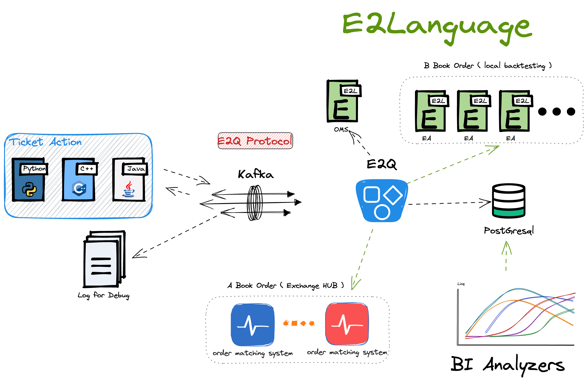

# 快速入门
> 系统运行图



> 运行测试代码

```
$ ./e2q -p ../cfg/db.properties -e /opt/e2q_doc/e2l_script/base/ea.e2  -s /opt/e2q_doc/e2l_script/base/oms.e2 
6956->[E2Q.cpp::exchange line.73] server is run!
6956->[Fusion.cpp::Fusion line.74] version:0.1.0
[Child] I'm Child process
[Child] Child's PID is 6957 name: /opt/volume/e2q_doc/e2l_script/base/ea.e2 
6957->[E2Q.cpp::trader line.96] node is run
6957->[Fusion.cpp::Fusion line.74] version:0.1.0
6956->[Consumer.cpp::handle line.662] rdkafka#consumer-2 Created consumer 
e2l version:0.1.0
6957->[MachineOS.cpp::enter line.137] initiator start, e2l path:/opt/volume/e2q_doc/e2l_script/base/ea.e2
6957->[MachineOS.cpp::enter line.150] node start ok!

```

> 让系统停止，需要往 Kafka 发送指令

```
$ echo "E" | eval "~/kafka/kafka_2.12-3.7.0/bin/kafka-console-producer.sh --broker-list localhost:9092 --topic fix-events"
```

系统已正常运行
