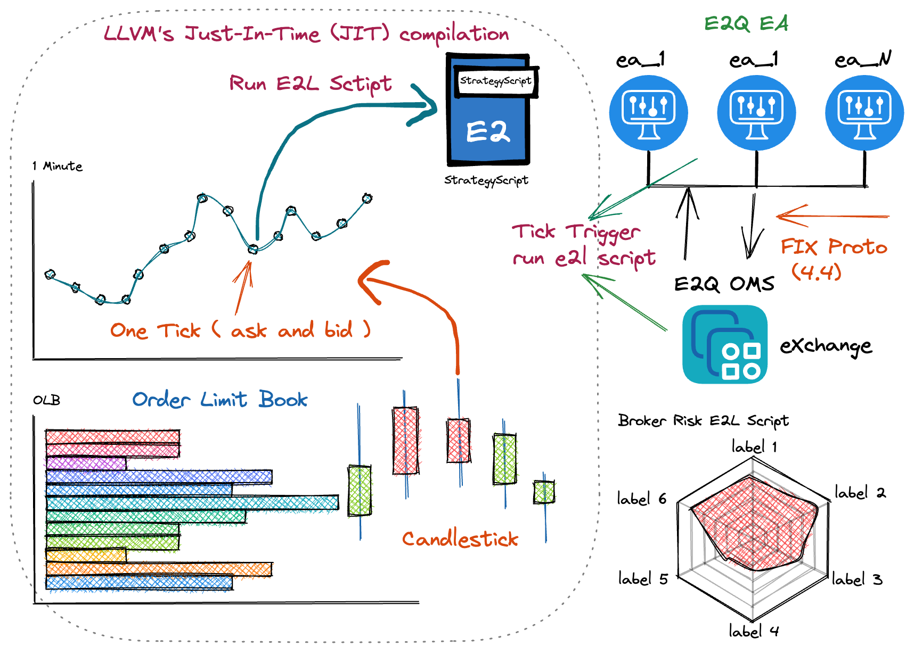

# E2L 语言

运行思维图




## E2L 关键词

> 这是 E2L 中的保留字列表。因为它们为语言所用，故这些关键词不可用于重定义。

- Body 类
    - "namespace" {命名空间}
    - "this" {namespace 调用}
    - "self" {namespace 定义私有函数}
    - "union" { 结构体 }
    - "func"  { 函数体 }
    - "import" { 引入代码 }
- 多条件类
    - "switch"		
    - "case"		
    - "default"		
- 单条件类
    - "if"		
    - "else"			
- 循环类
    - "for"		
    - "do"			
    - "while"			
- 跳转类
    - "continue"		
    - "break"			
    - "return"		

## 变量类型

- 整数
- 字符串

```
 价格是整数字段，提供了相关的精度。精度是在编译代码的时候 CMakeLists.txt 中设置, 精度设置为：*10000*
```

```
# CMakeLists.txt
# number deci for expression
add_definitions(-DNUMBER_DECI=10000)
```

比如一个 symbol 的价格为: 5.89 ,那么在 e2l 中是: 58900

## 代码注释: *#*

```
# 
# 此处是注释。。。
#
test = 10;
c = abc(5);  # 注释
b = c + myunion.a;
str = "hello!"; ## 字符串

```

## 引入别的文件

```
import <file.e2>
```

 

## union 结构

>常量，不可变

```
union myunion{
    a=1;
    union inner_union{
      b=1;
    }
}
```

## 函数
```
func abc(a){
    b=10 + a; 
    return b; 
}
```

## 条件语法

```
###
##  if else
###
func label(a){
    b=1;
    if(a>=5){
        b=2;
    }else{
        b=5;
    }
    return b;
}

b=9;
echo(b);

s=label(2);
echo(s);

###
##  for
###
func abc(a){
    c=a;
    for(b=a;b<10;b++){
        c=b+a;
    }

    return c;
}

s= abc(2);
echo(s);

###
##  while
###
func uik(a){
b=2;
 while ( a < 5 ){
    a= a+b;
    echo(a);
}
return a;
}

b=uik(1);
echo(b);

c = abc(5);  
c++;

b = c + myunion.a + myunion.inner_union.b;
echo(b);

e = 10;
k=label(9);
echo(k);

s= afor(2);
```

## 外部函数
```
echo(10);

```

---
## namespace 命名空间说明

> 是由用户定义的一个变量及函数空间的结构

---
- 命名空间关键词  名称 { 成员说明 }	
    - 成员说明 
        - this::[变量名称] = [值]
        - (self) function [函数] { 函数内容 }
- 内部调用
    - 函数及变量都在名称前加上 {this::}
- 外部调用
    - 命名空间名称<tag>::[函数]

---

### E2L 基本语法案例展示

```c++
#--------
# Name: union
# Description: 
#  union 结构定义全局变量 
#--------	
union my_union {
    static = 1;	
}
#----- union end


## namespace 命名空间
namespace myns {

## 命名空间 myns 的私有变量
    this::var = 1;
    this::two = 2;

    func myns(n) {
        if(n>5){
            # 私有变量的运算
            this::var = n;
        }
        # 全局变量 的运算
        this::two = n + my_union.static;
    }
    	
    func set( x ) {
## 调用 myns 的myns 函数
        this::myns(x); 

        this::two = x;
    }
    func get() { 
        ret = this::var +  3 + this::two ;
        return  ret;       
    }       
}

namespace myt{
    this::a = 9;
 
    func init(x) {
        this::a = x;
    }
    func get(u){

        return this::a;
    }
}

func main() {
    okv = 2;
  #  myns<a>::myns(okv);    
    myns<a>::set(okv);
    ret = myns<a>::get();
    echo(ret); 

    dd=5;
    myns<e>::set(dd);
    next = myns<e>::get();
    echo(next);

    tret = myt<e>::get(dd);
    echo(tret);

    return ret;
}
#----- func end

ret=main();

```

### E2L IR 代码
```
Function return type does not match operand type of return inst!
  ret void
 i64Call parameter type does not match function signature!
i64* getelementptr inbounds ([43 x i64], [43 x i64]* @.str, i64 0, i64 0)
 i64  %0 = call i64 (i64, ...) @printf(i64* getelementptr inbounds ([43 x i64], [43 x i64]* @.str, i64 0, i64 0), i64 %codeLine, i64 %varname, i64 %toPrint, i64 %varpath)
Function arguments must have first-class types!
void %val17008502563505747485
Function return type does not match operand type of return inst!
  ret void
 i64Integer arithmetic operators only work with integral types!
  %mathtmp = add double* %castdb, %castdb7
Stored value type does not match pointer operand type!
  store double* %mathtmp, i64* %myns_two, align 8
 double*Integer arithmetic operators only work with integral types!
  %mathtmp = add double* %castdb, %castdb4
Integer arithmetic operators only work with integral types!
  %mathtmp7 = add double* %mathtmp, %castdb6
Stored value type does not match pointer operand type!
  store double* %mathtmp7, i64* %ret, align 8
 double*Call parameter type does not match function signature!
i8* getelementptr inbounds ([4 x i8], [4 x i8]* @0, i32 0, i32 0)
 i64  call void @echo(i64 %ret2, i8* getelementptr inbounds ([4 x i8], [4 x i8]* @0, i32 0, i32 0), i64 51, i8* getelementptr inbounds ([50 x i8], [50 x i8]* @1, i32 0, i32 0))
Call parameter type does not match function signature!
i8* getelementptr inbounds ([5 x i8], [5 x i8]* @2, i32 0, i32 0)
 i64  call void @echo(i64 %next4, i8* getelementptr inbounds ([5 x i8], [5 x i8]* @2, i32 0, i32 0), i64 56, i8* getelementptr inbounds ([50 x i8], [50 x i8]* @3, i32 0, i32 0))
Call parameter type does not match function signature!
i8* getelementptr inbounds ([5 x i8], [5 x i8]* @4, i32 0, i32 0)
 i64  call void @echo(i64 %tret6, i8* getelementptr inbounds ([5 x i8], [5 x i8]* @4, i32 0, i32 0), i64 59, i8* getelementptr inbounds ([50 x i8], [50 x i8]* @5, i32 0, i32 0))
Global variable initializer type does not match global variable type!
[43 x i64]* @.str
; ModuleID = 'e2l.1804289383'
source_filename = "e2l.1804289383"

%NameSpace.myns = type { i64, i64 }
%NameSpace.myt = type { i64 }

@.str = private constant [43 x i64] c"%ld [echo varname: %s  line:%ld, file:%s]\0A\00"
@sfd.ssfd.sfd = internal global i64 11980000
@my_union.static = internal constant i64 10000
@0 = private unnamed_addr constant [4 x i8] c"ret\00"
@1 = private unnamed_addr constant [50 x i8] c"/opt/e2q_doc/e2l_script/example/namespace_base.e2\00"
@2 = private unnamed_addr constant [5 x i8] c"next\00"
@3 = private unnamed_addr constant [50 x i8] c"/opt/e2q_doc/e2l_script/example/namespace_base.e2\00"
@4 = private unnamed_addr constant [5 x i8] c"tret\00"
@5 = private unnamed_addr constant [50 x i8] c"/opt/e2q_doc/e2l_script/example/namespace_base.e2\00"

declare i64 @printf(i64, ...)

define internal void @echo(i64 %codeLine, i64 %varname, i64 %toPrint, i64 %varpath) {
entry:
  %0 = call i64 (i64, ...) @printf(i64* getelementptr inbounds ([43 x i64], [43 x i64]* @.str, i64 0, i64 0), i64 %codeLine, i64 %varname, i64 %toPrint, i64 %varpath)
  ret void
}

declare i64 @last(i64)

declare void @call(i8)

declare i8 @tochar(...)

declare void @FPrintCurrentPath(void)

declare void @FVersion(...)

declare void @FGlobalUnion(...)

define internal i64 @main846930886(i64 %argc, i64 %argv) {
entry.846930886:
  %ret = alloca i64, align 8
  %0 = call i64 @main()
  store i64 %0, i64* %ret, align 8
  ret void
}

define internal i64 @"myns_myns_#"(%NameSpace.myns* noundef nonnull align 8 dereferenceable(16) %"myns_myns_#_self") {
"myns_myns_#":
  %"myns_myns_#_self1" = alloca %NameSpace.myns*, align 8
  store %NameSpace.myns* %"myns_myns_#_self", %NameSpace.myns** %"myns_myns_#_self1", align 8
  %"myns_myns_#_self12" = load %NameSpace.myns*, %NameSpace.myns** %"myns_myns_#_self1", align 8
  %myns_var = getelementptr inbounds %NameSpace.myns, %NameSpace.myns* %"myns_myns_#_self12", i32 0, i32 0
  store i64 10000, i64* %myns_var, align 8
  %myns_two = getelementptr inbounds %NameSpace.myns, %NameSpace.myns* %"myns_myns_#_self12", i32 0, i32 1
  store i64 20000, i64* %myns_two, align 8
  ret i64 0
}

define internal i64 @myns_myns(%NameSpace.myns* noundef nonnull align 8 dereferenceable(16) %myns_myns_self, i64 %n3) {
myns_myns:
  %myns_myns_self1 = alloca %NameSpace.myns*, align 8
  store %NameSpace.myns* %myns_myns_self, %NameSpace.myns** %myns_myns_self1, align 8
  %myns_myns_self12 = load %NameSpace.myns*, %NameSpace.myns** %myns_myns_self1, align 8
  %n = alloca i64, align 8
  store i64 %n3, i64* %n, align 8
  %n4 = load i64, i64* %n, align 8
  %cmptmp = icmp sgt i64 %n4, 50000
  br i1 %cmptmp, label %then, label %else

then:                                             ; preds = %myns_myns
  %n5 = load i64, i64* %n, align 8
  %myns_var = getelementptr inbounds %NameSpace.myns, %NameSpace.myns* %myns_myns_self12, i32 0, i32 0
  store i64 %n5, i64* %myns_var, align 8
  br label %end

else:                                             ; preds = %myns_myns
  br label %end

end:                                              ; preds = %else, %then
  %n6 = load i64, i64* %n, align 8
  %castdb = inttoptr i64 %n6 to double*
  %castdb7 = inttoptr i64 10000 to double*
  %mathtmp = add double* %castdb, %castdb7
  %myns_two = getelementptr inbounds %NameSpace.myns, %NameSpace.myns* %myns_myns_self12, i32 0, i32 1
  store double* %mathtmp, i64* %myns_two, align 8
  ret i64 0
}

define internal i64 @myns_set(%NameSpace.myns* noundef nonnull align 8 dereferenceable(16) %myns_set_self, i64 %x3) {
myns_set:
  %myns_set_self1 = alloca %NameSpace.myns*, align 8
  store %NameSpace.myns* %myns_set_self, %NameSpace.myns** %myns_set_self1, align 8
  %myns_set_self12 = load %NameSpace.myns*, %NameSpace.myns** %myns_set_self1, align 8
  %x = alloca i64, align 8
  store i64 %x3, i64* %x, align 8
  %x4 = load i64, i64* %x, align 8
  %0 = call i64 @myns_myns(%NameSpace.myns* %myns_set_self12, i64 %x4)
  %x5 = load i64, i64* %x, align 8
  %myns_two = getelementptr inbounds %NameSpace.myns, %NameSpace.myns* %myns_set_self12, i32 0, i32 1
  store i64 %x5, i64* %myns_two, align 8
  ret i64 0
}

define internal i64 @myns_get(%NameSpace.myns* noundef nonnull align 8 dereferenceable(16) %myns_get_self) {
myns_get:
  %myns_get_self1 = alloca %NameSpace.myns*, align 8
  store %NameSpace.myns* %myns_get_self, %NameSpace.myns** %myns_get_self1, align 8
  %myns_get_self12 = load %NameSpace.myns*, %NameSpace.myns** %myns_get_self1, align 8
  %ret = alloca i64, align 8
  %myns_var = getelementptr inbounds %NameSpace.myns, %NameSpace.myns* %myns_get_self12, i32 0, i32 0
  %myns_var3 = load i64, i64* %myns_var, align 8
  %castdb = inttoptr i64 %myns_var3 to double*
  %castdb4 = inttoptr i64 30000 to double*
  %mathtmp = add double* %castdb, %castdb4
  %myns_two = getelementptr inbounds %NameSpace.myns, %NameSpace.myns* %myns_get_self12, i32 0, i32 1
  %myns_two5 = load i64, i64* %myns_two, align 8
  %castdb6 = inttoptr i64 %myns_two5 to double*
  %mathtmp7 = add double* %mathtmp, %castdb6
  store double* %mathtmp7, i64* %ret, align 8
  %ret8 = load i64, i64* %ret, align 8
  ret i64 %ret8
}

define internal i64 @"myt_myt_#"(%NameSpace.myt* noundef nonnull align 8 dereferenceable(16) %"myt_myt_#_self") {
"myt_myt_#":
  %"myt_myt_#_self1" = alloca %NameSpace.myt*, align 8
  store %NameSpace.myt* %"myt_myt_#_self", %NameSpace.myt** %"myt_myt_#_self1", align 8
  %"myt_myt_#_self12" = load %NameSpace.myt*, %NameSpace.myt** %"myt_myt_#_self1", align 8
  %myt_a = getelementptr inbounds %NameSpace.myt, %NameSpace.myt* %"myt_myt_#_self12", i32 0, i32 0
  store i64 90000, i64* %myt_a, align 8
  ret i64 0
}

define internal i64 @myt_init(%NameSpace.myt* noundef nonnull align 8 dereferenceable(16) %myt_init_self, i64 %x3) {
myt_init:
  %myt_init_self1 = alloca %NameSpace.myt*, align 8
  store %NameSpace.myt* %myt_init_self, %NameSpace.myt** %myt_init_self1, align 8
  %myt_init_self12 = load %NameSpace.myt*, %NameSpace.myt** %myt_init_self1, align 8
  %x = alloca i64, align 8
  store i64 %x3, i64* %x, align 8
  %x4 = load i64, i64* %x, align 8
  %myt_a = getelementptr inbounds %NameSpace.myt, %NameSpace.myt* %myt_init_self12, i32 0, i32 0
  store i64 %x4, i64* %myt_a, align 8
  ret i64 0
}

define internal i64 @myt_get(%NameSpace.myt* noundef nonnull align 8 dereferenceable(16) %myt_get_self, i64 %u3) {
myt_get:
  %myt_get_self1 = alloca %NameSpace.myt*, align 8
  store %NameSpace.myt* %myt_get_self, %NameSpace.myt** %myt_get_self1, align 8
  %myt_get_self12 = load %NameSpace.myt*, %NameSpace.myt** %myt_get_self1, align 8
  %u = alloca i64, align 8
  store i64 %u3, i64* %u, align 8
  %myt_a = getelementptr inbounds %NameSpace.myt, %NameSpace.myt* %myt_get_self12, i32 0, i32 0
  %myt_a4 = load i64, i64* %myt_a, align 8
  ret i64 %myt_a4
}

define internal i64 @main() {
main:
  %okv = alloca i64, align 8
  store i64 20000, i64* %okv, align 8
  %myns_tag_a = alloca %NameSpace.myns, align 8
  %okv1 = load i64, i64* %okv, align 8
  %0 = call i64 @"myns_myns_#"(%NameSpace.myns* %myns_tag_a)
  %1 = call i64 @myns_set(%NameSpace.myns* %myns_tag_a, i64 %okv1)
  %ret = alloca i64, align 8
  %2 = call i64 @myns_get(%NameSpace.myns* %myns_tag_a)
  store i64 %2, i64* %ret, align 8
  %ret2 = load i64, i64* %ret, align 8
  call void @echo(i64 %ret2, i8* getelementptr inbounds ([4 x i8], [4 x i8]* @0, i32 0, i32 0), i64 51, i8* getelementptr inbounds ([50 x i8], [50 x i8]* @1, i32 0, i32 0))
  %dd = alloca i64, align 8
  store i64 50000, i64* %dd, align 8
  %myns_tag_e = alloca %NameSpace.myns, align 8
  %dd3 = load i64, i64* %dd, align 8
  %3 = call i64 @"myns_myns_#"(%NameSpace.myns* %myns_tag_e)
  %4 = call i64 @myns_set(%NameSpace.myns* %myns_tag_e, i64 %dd3)
  %next = alloca i64, align 8
  %5 = call i64 @myns_get(%NameSpace.myns* %myns_tag_e)
  store i64 %5, i64* %next, align 8
  %next4 = load i64, i64* %next, align 8
  call void @echo(i64 %next4, i8* getelementptr inbounds ([5 x i8], [5 x i8]* @2, i32 0, i32 0), i64 56, i8* getelementptr inbounds ([50 x i8], [50 x i8]* @3, i32 0, i32 0))
  %tret = alloca i64, align 8
  %myt_tag_e = alloca %NameSpace.myt, align 8
  %dd5 = load i64, i64* %dd, align 8
  %6 = call i64 @"myt_myt_#"(%NameSpace.myt* %myt_tag_e)
  %7 = call i64 @myt_get(%NameSpace.myt* %myt_tag_e, i64 %dd5)
  store i64 %7, i64* %tret, align 8
  %tret6 = load i64, i64* %tret, align 8
  call void @echo(i64 %tret6, i8* getelementptr inbounds ([5 x i8], [5 x i8]* @4, i32 0, i32 0), i64 59, i8* getelementptr inbounds ([50 x i8], [50 x i8]* @5, i32 0, i32 0))
  %ret7 = load i64, i64* %ret, align 8
  ret i64 %ret7
}

```