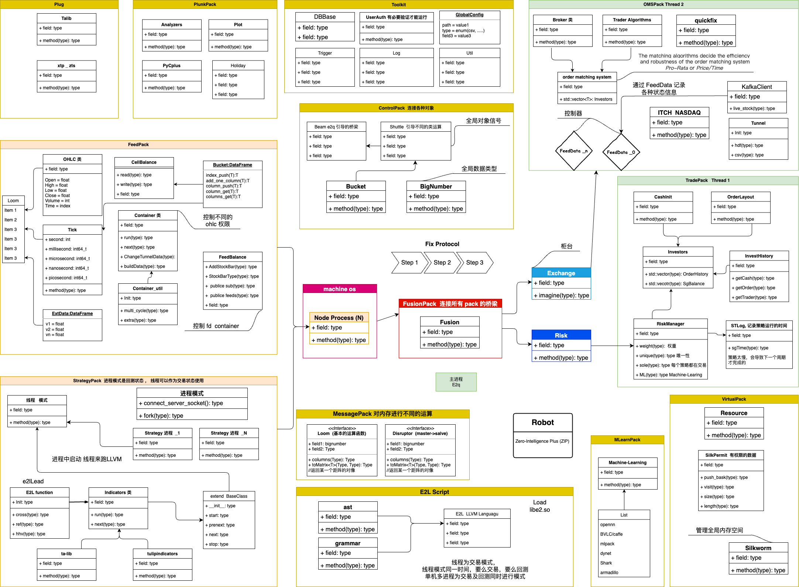
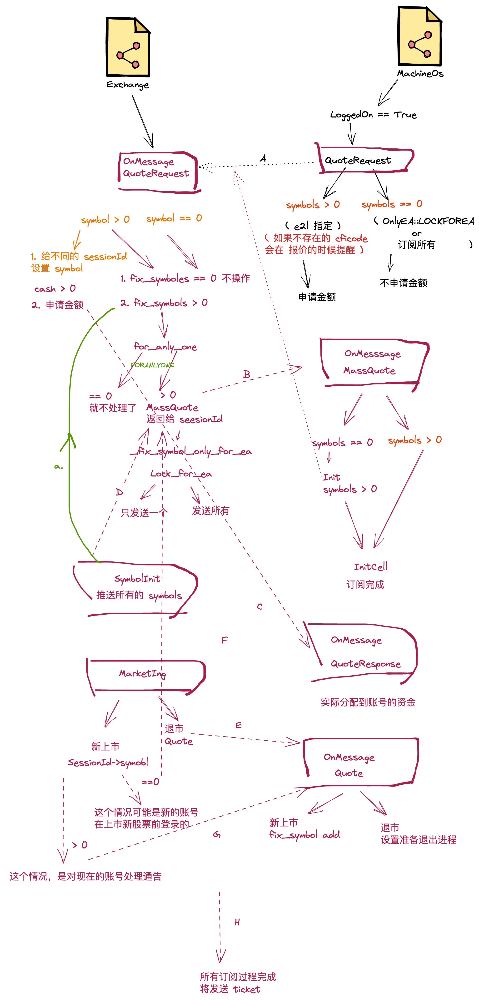

# E2Q 文档

[E2Quant](https://github.com/E2Quant) 是一个交易回测框架，仿真现实中整个交易系统，整个框架由：交易所(OMS), 券商(Broker), 交易者(Trader)三部分组成.

- 采用 ticket 报价: Price/Time 算法
- 可选择 AB book 方式
- 利用多进程多线程快速回测各种临界条件
- Trader 与 OMS 之间采用 FIX Protocol

## 思维图如下:


## 核心程序: e2q

```shell
/opt/e2q/build (master) $ ./e2q -h
./e2q -e script.e2
                 Usage:
                 -h help
                 -a if oms default fix account number or if ea account index
                 -b bin history ticket file directory
                 -d daemon run
                 -e which loading ea e2l script
                 -f log directory
                 -l show llvm ir for e2l
                 -n read number bin history tickets
                 -i e2l import codes directory,def:/usr/local/include/e2/
                 -s which loading oms e2l script
                 -o only test e2l script
                 -p which loading db properties
                 -r e2l run number
                 -v show e2q version

```
> 引导入口的 script 是由 e2l 语言开发

* `-s oms e2l script` - 交易所(oms), 主要工作是撮合 order, 计算收益, 券商 等功能, 该参数只允许一个
* `-e ea e2l script` - 交易者(trader)策略.可以多个参数同时使用
* `-o` - 可以简单运行 e2l 语言，但不包括 策略的 api.
* `-r` - 程序运行的次数，参数可以 e2l 语言获取.

## E2l Script 是策略语言

- 简单的语法
- 安全及简单的使用多进程及多线程
- 可生成字节码

## 支持在多股票回测的时候，使用退市及上市新股票，流程图如下

> 在新上市 cficode 中，可以支持读取过往的历史记录，历史记录文件，是 e2b 的订单文件，采用 E2Q Protocol 协议生成

