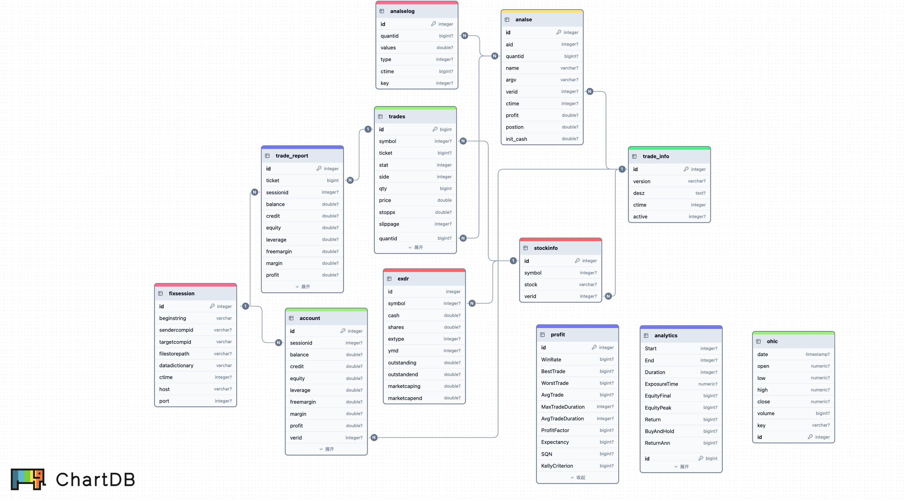
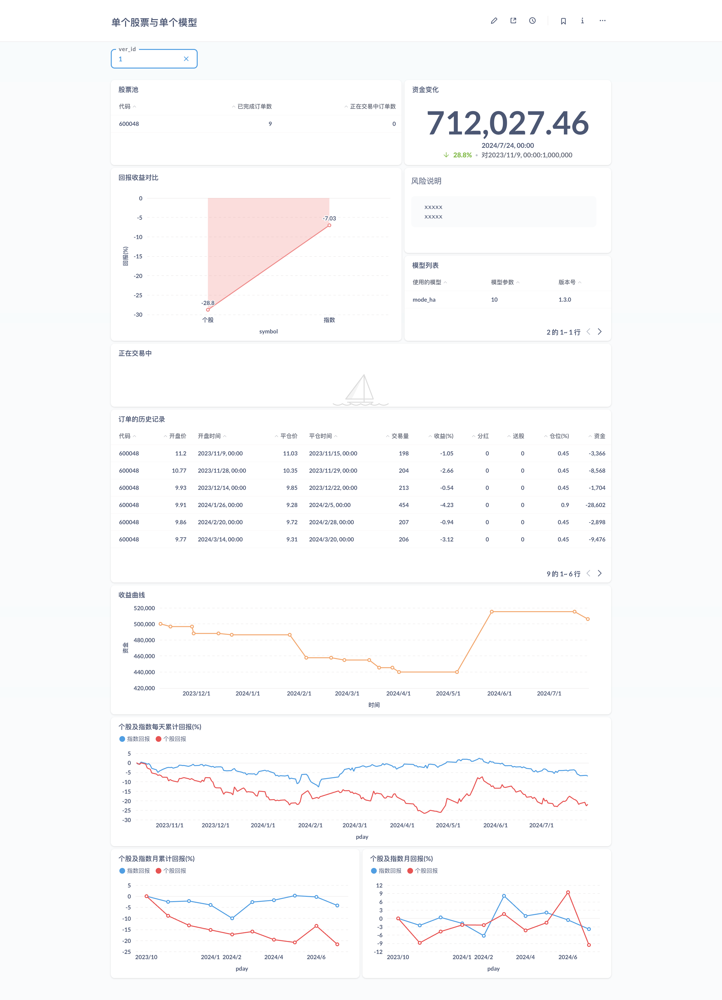

# 数据库

## 表关系图



---

## PG view 和 funcion

[e2q postgresql sql file](https://github.com/E2Quant/e2q/tree/main/cfg)

## view 部分说明


###  1.资金变化

* **e2q_cash**

> **说明:**
    初始化资金与当前资金的情况.


> 示例:
```
E2Q=> select * from e2q_cash;
-[ RECORD 1 ]---------------------
quantid   | 1032451500
name      | CLIENT874
stock     | 600519
verid     | 1
init_cash | 1000000
now_cash  | 1009794
diff_cash | 9794
diff_per  | 0.009794
day       | 2023-11-03 00:00:00+08
end_day   | 2024-07-22 00:00:00+08

```

---

###  2.资金变化

* **e2q_cash_se**

> **说明:**
    初始化资金与当前资金的情况.


> 示例:
```
E2Q=> select * from e2q_cash_se;
-[ RECORD 1 ]-------------------
quantid | 1032451498
name    | CLIENT874
stock   | 600030
tid     | 113
credit  | 1009794
verid   | 1
symbol  | 1
day     | 2024-07-22 00:00:00+08
stat    | end
-[ RECORD 2 ]-------------------
quantid | 1032451500
name    | CLIENT874
stock   | 600519
tid     | 1
credit  | 1000000
verid   | 1
symbol  | 3
day     | 2023-11-03 00:00:00+08
stat    | init

```
---


###  3.订单历史记录

* **e2q_history**

> **说明:**
    回测过程中的所有订单历史记录.


> 示例:
```
E2Q=> select * from e2q_history limit 2;
-[ RECORD 1 ]+-----------------------
sid          | 2
verid        | 1
symobl       | 179593
stock        | 600519
buy_price    | 1811.24
buy_time     | 2023-11-03 00:00:00+08
stop_price   | 1812
stop_time    | 2023-11-06 00:00:00+08
sell_adjpx   | 11131.702
buy_adjpx    | 11127.425
profit       | 0.038
closetck     | 1032451500
LossOrProfit | StopLoss
cash         | 0
share        | 0
quantid      | 1032451500
bticket      | 1032451500
sticket      | 1032451502
position     | 0.9
amount       | 304
qty          | 4
-[ RECORD 2 ]+-----------------------
sid          | 7
verid        | 1
symobl       | 179593
stock        | 600519
buy_price    | 1791.17
buy_time     | 2023-11-07 00:00:00+08
stop_price   | 1798.34
stop_time    | 2023-11-08 00:00:00+08
sell_adjpx   | 11054.827
buy_adjpx    | 11014.476
profit       | 0.366
closetck     | 1032451506
LossOrProfit | StopLoss
cash         | 0
share        | 0
quantid      | 1032451500
bticket      | 1032451506
sticket      | 1032451508
position     | 0.9
amount       | 717
qty          | 1

```

---

###  4.订单的仓位情况

* **e2q_postion**

> **说明:**
    回测过程中的关于订单占当前仓位的情况.


> 示例:
```
E2Q=> select * from e2q_postion limit 2;
-[ RECORD 1 ]-------------------
verid   | 1
quantid | 1032451498
values  | 0.9
type    | 2
date    | 2024-07-22 00:00:00+08
rule    | mode_m_8/17/30/60
-[ RECORD 2 ]-------------------
verid   | 1
quantid | 1032451498
values  | 0.9
type    | 2
date    | 2024-07-18 00:00:00+08
rule    | mode_m_8/17/30/60


```

---

###  5.参数的收益值

* **e2q_profit**

> **说明:**
    回测过程中的各个策略的参数收益情况.


> 示例:
```
E2Q=> SELECT * FROM "e2q_profit" limit 2;
-[ RECORD 1 ]+-------------
name         | mode_ma
argv         | 15/39
version      | 1.3.0
quantid      | 1036343292
init_cash    | 200000.00298
profit       | 198860.003
postion      | 0.2
verid        | 1
targetcompid | CLIENT2851
-[ RECORD 2 ]+-------------
name         | mode_vma
argv         | 5/13
version      | 1.3.0
quantid      | 1036343281
init_cash    | 200000.00298
profit       | 199148.003
postion      | 0.2
verid        | 1
targetcompid | CLIENT2852

```
---

###  6.风险(MVO)

* **e2q_risk_performance**

> **说明:**
    mean-variance optimization(MVO) 数据 .
    risk 相关的，都是采用[PyPortfolioOpt](
    https://pyportfolioopt.readthedocs.io/en/latest/UserGuide.html) 生成

> 示例:
```
E2Q=> SELECT * FROM e2q_risk_performance limit 2;
-[ RECORD 1 ]-------------------
risk    | Expected_annual_return
quantid | 1032131609
verid   | 1
values  | 0.3001
day     | 2024-07-30 00:00:00+08
-[ RECORD 2 ]-------------------
risk    | Annual_volatility
quantid | 1032131609
verid   | 1
values  | 38.2169
day     | 2024-07-30 00:00:00+08

```

---

###  7.收益曲线(包含风险)

* **e2q_risk_profit**

> **说明:**
     收益曲线

> 示例:
```
E2Q=> SELECT * FROM e2q_risk_profit limit 2;
-[ RECORD 1 ]-------------
symbol     | 1
ticket     | 1032131615
closetck   | 0
side       | 1
quantid    | 1032131609
ctime      | 1409673600000
amount     | 43875
buy_amount | 0
stock      | 600048
verid      | 1
profit     | 0
profit_pre | 0
-[ RECORD 2 ]-------------
symbol     | 1
ticket     | 1032131617
closetck   | 1032131615
side       | 2
quantid    | 1032131609
ctime      | 1410451200000
amount     | 42750
buy_amount | 43875
stock      | 600048
verid      | 1
profit     | -1125
profit_pre | -0.025

```
---

### 8. 个股的风险仓位分布

* **e2q_risk_value**

> **说明:**
    个股的风险仓位分布,(不再使用)

> 示例:
```
E2Q=> SELECT * FROM e2q_risk_value limit 2;
-[ RECORD 1 ]-------------------
quantid | 1032206436
values  | 0
day     | 2014-08-26 00:00:00+08
stock   | 601398
verid   | 5
-[ RECORD 2 ]-------------------
quantid | 1032206432
values  | 0
day     | 2014-08-26 00:00:00+08
stock   | 600048
verid   | 5

```

---

###  9.股票池

* **e2q_symbol_pool**

> **说明:**
    股票池列表.


> 示例:
```
E2Q=>  select * from e2q_symbol_pool limit 2;
-[ RECORD 1 ]--+-----------
quantid        | 1036343281
count          | 2
verid          | 1
stock          | 600048
trader_number  | 2
trading_number | 0
-[ RECORD 2 ]--+-----------
quantid        | 1036343282
count          | 6
verid          | 1
stock          | 600048
trader_number  | 5
trading_number | 1

```

---

###  10.正在交易中

* **e2q_trading**

> **说明:**
    正在交易进行中的订单.


> 示例:
```
E2Q=> select * from e2q_trading limit 2;
-[ RECORD 1 ]-----------
id         | 1571
verid      | 5
symbol     | 294522
stock      | 600028
open_price | 4.12
open_qty   | 435
open_time  | 2022/11/02
ticket     | 1036344727
amount     | 179220
quantid    | 1036345708
name       | mode_adxvma
argv       | 25/65
-[ RECORD 2 ]-----------
id         | 1952
verid      | 6
symbol     | 294523
stock      | 601398
open_price | 4.32
open_qty   | 46
open_time  | 2022/12/28
ticket     | 1036345108
amount     | 19872
quantid    | 1036346309
name       | mode_adxvma
argv       | 20/52

```

---

###  11.各个版本的收益统计

* **e2q_risk_profit_count**

> **说明:**
    各个版本的收益统计.

> 示例:
```
E2Q=> select * from e2q_risk_profit_count limit 2;
-[ RECORD 1 ]-------+--
profit<=-20.0       | 0
-20.0<profit<=-10.0 | 0
-10.0<profit<=-5.0  | 3
-5.0<profit<=0      | 2
0<profit<=5.0       | 1
5.0<profit<=10.0    | 2
10.0<profit<=30.0   | 0
30.0<profit<=80.0   | 0
80.0<profit         | 0
```

---

###  12.各个版本的收益列

* **e2q_risk_profit_count_list**

> **说明:**
    各个版本的收益列表.

> 示例:
```
E2Q=>  select * from e2q_risk_profit_count_list limit 2;
-[ RECORD 1 ]---------------
credits | 922101.3
profit  | -7.789869999999996
verid   | 4
-[ RECORD 2 ]---------------
credits | 943889.2
profit  | -5.611080000000005
verid   | 2
```
---

###  13.当前所有回测数据收益范围图表

* **e2q_risk_profit_count_row**

> **说明:**
    当前所有回测数据收益范围图表.

> 示例:
```
E2Q=> select * from e2q_risk_profit_count_row;
-[ RECORD 1 ]--------------
key   | profit<=-20.0
value | 0
-[ RECORD 2 ]--------------
key   | -20.0<profit<=-10.0
value | 0
-[ RECORD 3 ]--------------
key   | -10.0<profit<=-5.0
value | 0
-[ RECORD 4 ]--------------
key   | -5.0<profit<=0
value | 3
-[ RECORD 5 ]--------------
key   | 0<profit<=5.0
value | 0
-[ RECORD 6 ]--------------
key   | 5.0<profit<=10.0
value | 3
-[ RECORD 7 ]--------------
key   | 10.0<profit<=30.0
value | 4
-[ RECORD 8 ]--------------
key   | 30.0<profit<=80.0
value | 1
-[ RECORD 9 ]--------------
key   | 80.0<profit
value | 0
```
---

###  14.股票状态

* **e2q_symbol_status**

> **说明:**
    股票状态.

> 示例:
```
E2Q=> select * from e2q_symbol_status limit 5;
-[ RECORD 1 ]---------------
id     | 361
stock  | 600875
sday   | 2017-01-09 12:00:00
status | 交易
verid  | 6
-[ RECORD 2 ]---------------
id     | 482
stock  | 600098
sday   | 2018-05-03 12:00:00
status | 退出
verid  | 7
-[ RECORD 3 ]---------------
id     | 396
stock  | 000060
sday   | 2020-05-07 12:00:00
status | 退出
verid  | 6
-[ RECORD 4 ]---------------
id     | 684
stock  | 000528
sday   | 2023-09-04 12:00:00
status | 退出
verid  | 10
-[ RECORD 5 ]---------------
id     | 125
stock  | 001979
sday   | 2020-10-12 12:00:00
status | 退出
verid  | 3
```
---

###  15.取委托的订单

* **e2q_trade_detail**

> **说明:**
    取委托的订单.

> 示例:
```
E2Q=> select * from e2q_trade_detail limit 5;
(0 rows)
```
---

## function 部分说明

---

###  1.按版本查看不同账号资金情况

* **quant_account**

> **说明:**
    按版本查看不同账号资金情况.

    - 参数: version_id 

> 示例:
```
E2Q=> SELECT * FROM quant_account(1);
-[ RECORD 1 ]+----------
targetcompid | CLIENT845
sessionid    | 845
balance      | 925602.88
margin       | 0
all_cash     | 925602.88
mode         | mode_ha

```

---

###  2.各个账号的账号的资金变动概要(日)

* **quant_account_credit**

> **说明:**
    各个账号的账号的资金变动概要(日).

    - 参数: version_id 

> 示例:
```
E2Q=> SELECT * FROM quant_account_credit(1) limit 2;
-[ RECORD 1 ]+-----------------------
credit       | 1000000
targetcompid | CLIENT2850
pday         | 2022-07-27 00:00:00+08
-[ RECORD 2 ]+-----------------------
credit       | 980968
targetcompid | CLIENT2850
pday         | 2022-08-03 00:00:00+08

```

---

###  3.各个账号的资金波动(最大/小的百分比)

* **quant_account_credit_bands**

> **说明:**
    各个账号的资金波动(最大/小的百分比).

    - 参数: version_id 

> 示例:
```
E2Q=> SELECT * FROM quant_account_credit_bands(1) limit 2;
-[ RECORD 1 ]-+-----------------------
btargetcompid | CLIENT2852
bmax_credit   | 1000252
bmin_credit   | 990243
binit_credit  | 1000000
bmpday        | 2022-08-16 00:00:00+08
-[ RECORD 2 ]-+-----------------------
btargetcompid | CLIENT2850
bmax_credit   | 1000000
bmin_credit   | 899328
binit_credit  | 1000000
bmpday        | 2022-07-27 00:00:00+08

```

---

###  4.各个账号的收益曲线(日)

* **quant_account_credit_day**

> **说明:**
    各个账号的收益曲线(日).

    - 参数: version_id 

> 示例:
```
E2Q=> SELECT * FROM quant_account_credit_day(1) limit 2;
-[ RECORD 1 ]-+-----------------------
dcredit       | 1000000
dtargetcompid | CLIENT2850
dpday         | 2022-07-27 00:00:00+08
dreturn_value | 0
-[ RECORD 2 ]-+-----------------------
dcredit       | 980968
dtargetcompid | CLIENT2850
dpday         | 2022-08-03 00:00:00+08
dreturn_value | -1.9032

```

---

###  5.各个账号的收益曲线(月)

* **quant_account_credit_month**

> **说明:**
    各个账号的收益曲线(月).

    - 参数: version_id 

> 示例:
```
E2Q=> SELECT * FROM quant_account_credit_month(1) limit 2;
-[ RECORD 1 ]-+-----------
dcredit       | 1000000
dtargetcompid | CLIENT2850
dpday         | 2022-07
dreturn_value | 0
-[ RECORD 2 ]-+-----------
dcredit       | 899328
dtargetcompid | CLIENT2850
dpday         | 2022-08
dreturn_value | -10.0672

```

---

###  6.各个账号的累计收益(%)

* **quant_account_credit_sum**

> **说明:**
    各个账号的累计收益(%).

    - 参数: version_id 

> 示例:
```
E2Q=> SELECT * FROM quant_account_credit_sum(1) limit 2;
-[ RECORD 1 ]-+-----------------------
dcredit       | 1000000
dtargetcompid | CLIENT2850
dpday         | 2022-07-27 00:00:00+08
dreturn_value | 0
-[ RECORD 2 ]-+-----------------------
dcredit       | 980968
dtargetcompid | CLIENT2850
dpday         | 2022-08-03 00:00:00+08
dreturn_value | -1.9032

```

---

###  7.各个 QuantId 的资金波动(最大/小的百分比)

* **quant_bands**

> **说明:**
    各个 QuantId 的资金波动(最大/小的百分比).

    - 参数: version_id 

> 示例:
```
E2Q=> SELECT * FROM quant_bands(1) limit 2;
-[ RECORD 1 ]----------------------
idxs      | 1
quantid   | 1036343299
name      | mode_adxvma
argv      | 5/13
init_cash | 200000.00298
min_pro   | 171021
max_pro   | 200000
min_diff  | -14.489501274106425
max_diff  | -1.4899999729002438e-06
-[ RECORD 2 ]----------------------
idxs      | 2
quantid   | 1036343301
name      | mode_adxvma
argv      | 15/39
init_cash | 200000.00298
min_pro   | 180968
max_pro   | 200000
min_diff  | -9.516001348211574
max_diff  | -1.4899999729002438e-06

```

---

###  8.订单交易时长比较(天)

* **quant_order_day**

> **说明:**
    各个 QuantId 的资金波动(最大/小的百分比).

    - 参数: version_id 

> 示例:
```
E2Q=> SELECT * FROM quant_order_day(1) limit 2;
-[ RECORD 1 ]-----------
rquantid    | 1036343300
order_stock | 600048
order_day   | 7
-[ RECORD 2 ]-----------
rquantid    | 1036343299
order_stock | 600048
order_day   | 8

```

---

###  9.订单收益过程中涨跌波幅张度(%)

* **quant_order_tl**

> **说明:**
    订单收益过程中涨跌波幅张度(%).

    - 参数: version_id 

> 示例:
```
E2Q=> SELECT * FROM quant_order_tl(1) limit 2;
-[ RECORD 1 ]--------
rquantid | 1036343300
rvalue   | -5.42
rticket  | 1036343155
rvtype   | loss
-[ RECORD 2 ]--------
rquantid | 1036343300
rvalue   | -8.409
rticket  | 1036343155
rvtype   | order

```

---

###  10.策略 ID 资金的详细变化.

* **quant_profit**

> **说明:**
    订单收益过程中涨跌波幅张度(%).

    - 参数: quant_id 

> 示例:
```
E2Q=> SELECT * FROM quant_profit(1036343292) limit 2;
-[ RECORD 1 ]-------------------
qid        | 1036343292
margin     | 9140
rticket    | 243
profits    | 0
pday       | 2024-01-12 00:00:00
pside      | 1
profit_x   | 200000
profit_sum | 200000
-[ RECORD 2 ]-------------------
qid        | 1036343292
margin     | 0
rticket    | 272
profits    | 8000
pday       | 2024-04-16 00:00:00
pside      | 2
profit_x   | -1140
profit_sum | 198860

```


---

###  11.资金的详细变化.

* **quant_profit**

> **说明:**
    资金的详细变化.

    - 参数: verid 
    - 参数: offset 

> 示例:
```
E2Q=>  SELECT * FROM quant_profit_one_verid(1,0) limit 2;
-[ RECORD 1 ]--------------------
vday        | 2022-07-27 00:00:00
vprofit_sum | 200000
stat        | 开仓
pqid        | 1036343299
qverid      | 1
-[ RECORD 2 ]--------------------
vday        | 2022-08-04 00:00:00
vprofit_sum | 180344
stat        | 平仓
pqid        | 1036343299
qverid      | 1


```

###  12.个股及指数每天回报(%)

* **quant_return_day**

> **说明:**
    个股及指数每天回报(%).
    
    - 参数: cficode 

> 示例:
```
E2Q=> SELECT * from quant_return_day(179591) limit 5;
-[ RECORD 1 ]+----------------------
rstock       | 600048
pday         | 2014-06-04 00:00:00
price        | 89.1838
return_value | 0
-[ RECORD 2 ]+----------------------
rstock       | 600048
pday         | 2014-06-05 00:00:00
price        | 86.9694
return_value | -0.024829621523191563
-[ RECORD 3 ]+----------------------
rstock       | 600048
pday         | 2014-06-06 00:00:00
price        | 88.077
return_value | 0.012735513870395853
-[ RECORD 4 ]+----------------------
rstock       | 600048
pday         | 2014-06-09 00:00:00
price        | 88.235
return_value | 0.0017938848961704106
-[ RECORD 5 ]+----------------------
rstock       | 600048
pday         | 2014-06-10 00:00:00
price        | 91.3986
return_value | 0.03585425284750952

```

---

###  13.返回个股月回报

* **quant_return_fmonth**

> **说明:**
    返回个股月回报.
    
    - 参数: cficode 

> 示例:
```
E2Q=> SELECT * from quant_return_fmonth(179591) limit 5;
-[ RECORD 1 ]+--------------------
rstock       | 600048
pday         | 2014-06
price        | 89.1838
return_value | 0
-[ RECORD 2 ]+--------------------
rstock       | 600048
pday         | 2014-07
price        | 88.551
return_value | -0.7095459040767529
-[ RECORD 3 ]+--------------------
rstock       | 600048
pday         | 2014-08
price        | 105.1606
return_value | 18.757100428001944
-[ RECORD 4 ]+--------------------
rstock       | 600048
pday         | 2014-09
price        | 99.7822
return_value | -5.114463021321672
-[ RECORD 5 ]+--------------------
rstock       | 600048
pday         | 2014-10
price        | 97.8842
return_value | -1.9021428671646807

```

---

###  14.返回个股月累计回报

* **quant_return_month**

> **说明:**
    返回个股月累计回报.
    
    - 参数: cficode 

> 示例:
```
E2Q=> SELECT * from quant_return_month(179591) limit 5;
-[ RECORD 1 ]+--------------------
rstock       | 600048
pday         | 2014-06
price        | 89.1838
return_value | 0
-[ RECORD 2 ]+--------------------
rstock       | 600048
pday         | 2014-07
price        | 88.551
return_value | -0.7095459040767529
-[ RECORD 3 ]+--------------------
rstock       | 600048
pday         | 2014-08
price        | 105.1606
return_value | 17.91446428611474
-[ RECORD 4 ]+--------------------
rstock       | 600048
pday         | 2014-09
price        | 99.7822
return_value | 11.88377261341185
-[ RECORD 5 ]+--------------------
rstock       | 600048
pday         | 2014-10
price        | 97.8842
return_value | 9.755583413131086

```

---

###  15.返回个股日线周期累计回报收益

* **quant_return**

> **说明:**
    返回个股日线周期累计回报收益.
    
    - 参数: cficode 

> 示例:
```
E2Q=> SELECT * from quant_return(179591) limit 5;
-[ RECORD 1 ]+--------------------
rstock       | 600048
pday         | 2014-06-04 00:00:00
price        | 89.1838
return_value | 0
-[ RECORD 2 ]+--------------------
rstock       | 600048
pday         | 2014-06-05 00:00:00
price        | 86.9694
return_value | -2.482962152319156
-[ RECORD 3 ]+--------------------
rstock       | 600048
pday         | 2014-06-06 00:00:00
price        | 88.077
return_value | -1.2410325642100994
-[ RECORD 4 ]+--------------------
rstock       | 600048
pday         | 2014-06-09 00:00:00
price        | 88.235
return_value | -1.0638703441656507
-[ RECORD 5 ]+--------------------
rstock       | 600048
pday         | 2014-06-10 00:00:00
price        | 91.3986
return_value | 2.483410664268619

```

---

###  16.各个 QuantId 止赢止损平仓(数量)比

* **quant_take_loss**

> **说明:**
    各个 QuantId 止赢止损平仓(数量)比.
    
    - 参数: verid 

> 示例:
```
E2Q=> SELECT * from quant_take_loss(1) limit 2;
-[ RECORD 1 ]-------
type    | 100
stat    | 策略平仓
quantid | 1036343281
number  | 3
-[ RECORD 2 ]-------
type    | 100
stat    | 策略平仓
quantid | 1036343282
number  | 7

```

---

###  17.基本指标-adxvma

* **indicator_adxvma**

> **说明:**
    基本指标-adxvma.
    
    - 参数: verid 

> 示例:
```
E2Q=> SELECT * from indicator_adxvma(1) limit 2;
-[ RECORD 1 ]-------
type    | 100
stat    | 策略平仓
quantid | 1036343281
number  | 3
-[ RECORD 2 ]-------
type    | 100
stat    | 策略平仓
quantid | 1036343282
number  | 7

```

---

###  18.基本指标-report log

* **indicator_report_log **

> **说明:**
    基本指标-adxvma.
    
    - 参数: verid 
    - 参数: 类型ID

> 示例:
```
E2Q=> SELECT * from indicator_report_log (1, 60) limit 2;
-[ RECORD 1 ]-------
type    | 100
stat    | 策略平仓
quantid | 1036343281
number  | 3
-[ RECORD 2 ]-------
type    | 100
stat    | 策略平仓
quantid | 1036343282
number  | 7

```

---
###  19.基本指标-SharpeRatio

* **indicator_sharpe_ratio **

> **说明:**
    基本指标-adxvma.
    
    - 参数: verid 
    
> 示例:
```
E2Q=> SELECT * from indicator_sharpe_ratio (1) limit 2;
(0 rows)


```

---

###  20.各种时长的综合收益比(%)

* **quant_order_day_sum **

> **说明:**
    各种时长的综合收益比(%).
    
    - 参数: verid 
    
> 示例:
```
E2Q=>  SELECT * from quant_order_day_count (1) ;
       profits       | time_long
---------------------+-----------
 -1.2371564278554426 | 1-5
   2.587309727542426 | 20-90
  -2.925019796170004 | 5-20
   4.994651350376545 | 90
(4 rows)

```

---

###  21.资金波动(%)/日

* **quant_order_day_sum **

> **说明:**
    资金波动(%)/日.
    
    - 参数: verid 
    
> 示例:
```
E2Q=> select * from quant_risk_profix(1) limit 2;
 rid |  rquantid  |          rday          | rcredit | rpcredit_first | rpcredit_pre
-----+------------+------------------------+---------+----------------+--------------
   1 | 1055023176 | 2021-05-12 00:00:00+08 | 1000000 |              0 |            0
   3 | 1055023180 | 2021-05-12 00:00:00+08 | 1000000 |              0 |            0
(2 rows)

```

---

###  21.资金波动(%)/月

* **quant_risk_profix_month **

> **说明:**
    资金波动(%)/月.
    
    - 参数: verid 
    
> 示例:
```
E2Q=> select * from quant_risk_profix_month(1) limit 2;
 rid |  rquantid  |  rday   | rcredit | rpcredit_first |    rpcredit_pre
-----+------------+---------+---------+----------------+---------------------
   1 | 1055023176 | 2021-05 | 1000000 |              0 |                   0
  33 | 1055023160 | 2021-06 | 1002528 |           2528 | 0.25279999999999997
(2 rows)

```

---

###  22.资金波动(%)/月

* **quant_risk_profix_month **

> **说明:**
    资金波动(%)/月.
    
    - 参数: verid 
    
> 示例:
```
E2Q=> select * from quant_risk_profix_month(1) limit 2;
 rid |  rquantid  |  rday   | rcredit | rpcredit_first |    rpcredit_pre
-----+------------+---------+---------+----------------+---------------------
   1 | 1055023176 | 2021-05 | 1000000 |              0 |                   0
  33 | 1055023160 | 2021-06 | 1002528 |           2528 | 0.25279999999999997
(2 rows)

```

---

###  23.账号每天余额

* **risk_balance_for_day **

> **说明:**
    账号每天余额.
    
    - 参数: verid 
    - 参数: _init_cash 初始化的金额
    
> 示例:
```
E2Q=> select * from risk_balance_for_day(1,10000000) limit 3;
          tday          | balances
------------------------+----------
 2021-05-12 00:00:00+08 | 41645046
 2021-05-13 00:00:00+08 | 23197601
 2021-05-14 00:00:00+08 | 13747785
(3 rows)
```

---

###  24.账号余额

* **risk_balance_for_total **

> **说明:**
    账号余额.
    
    - 参数: verid 
    - 参数: _init_cash 初始化的金额

> 关联: risk_balance_for_total_loop
    
> 示例:
```

```

---

###  25.账号每天信用

* **risk_credit_for_day **

> **说明:**
    账号每天信用.
    
    - 参数: verid 
    - 参数: _init_cash 初始化的金额
    
> 示例:
```
E2Q=> select * from risk_credit_for_day(1,10000000) limit 5;
          tday          |  credits
------------------------+------------
 2024-07-29 00:00:00+08 | 7436564.85
 2024-07-24 00:00:00+08 | 7425219.85
 2024-07-23 00:00:00+08 | 7419234.05
 2024-07-12 00:00:00+08 | 7525032.05
 2024-07-11 00:00:00+08 | 7525035.05
(5 rows)

```

---

###  26.账号信用

* **risk_credit_for_total **

> **说明:**
    账号信用.
    
    - 参数: verid 
    - 参数: _init_cash 初始化的金额

> 关联: risk_credit_for_total_loop
    
> 示例:
```

```

---

###  27.账号每天投入金

* **risk_credit_for_day **

> **说明:**
    账号每天投入金.
    
    - 参数: verid 
    - 参数: _init_cash 初始化的金额
    
> 示例:
```
E2Q=> select * from risk_margin_for_day(1,10000000) limit 5;
          tday          | margins
------------------------+----------
 2021-05-12 00:00:00+08 | 41354954
 2021-05-13 00:00:00+08 | 21798092
 2021-05-14 00:00:00+08 | 12247908
 2021-05-20 00:00:00+08 | 11349142
 2021-05-21 00:00:00+08 | 11820306
(5 rows)
```

---

###  28.账号投入金

* **risk_margin_for_total **

> **说明:**
    账号投入金.
    
    - 参数: verid 
    - 参数: _init_cash 初始化的金额

> 关联: risk_margin_for_total_loop
    
> 示例:
```

```

---

###  29.订单收益回报(%)

* **risk_returns_for_day **

> **说明:**
    订单收益回报.
    
    - 参数: verid 
    - 参数: _init_cash 初始化的金额
    
> 示例:
```
E2Q=> select * from risk_returns_for_day(1,10000000) limit 5;
         tdays          | credits  |     returns_day
------------------------+----------+---------------------
 2021-05-12 00:00:00+08 | 43000000 |                   0
 2021-05-13 00:00:00+08 | 24995693 |  -41.87048139534883
 2021-05-14 00:00:00+08 | 15995693 | -62.800713953488376
 2021-05-20 00:00:00+08 | 16034749 | -62.709886046511635
 2021-05-21 00:00:00+08 | 16034746 | -62.709893023255816
(5 rows)

```

---


###  30.订单收益回报(%)/月

* **risk_returns_for_month **

> **说明:**
    订单收益回报(%)/月.
    
    - 参数: verid 
    - 参数: _init_cash 初始化的金额
    
> 示例:
```
E2Q=> select * from risk_returns_for_month(1,10000000) limit 5;
  tdays  |   credits   |   returns_month
---------+-------------+--------------------
 2021-05 |    43000000 |                  0
 2021-06 |    16023293 | -62.73652790697675
 2021-07 | 16055731.23 |  -62.6610901627907
 2021-08 |  7096224.67 | -83.49715193023255
 2021-09 |  7062237.67 | -83.57619146511628
(5 rows)
```

---

## 多股票风险 部分说明

###  1.每日累计收益回报情况(%)

* **risk_credit_for_day**

> **说明:**
    每日累计收益回报情况(%).
    
    - 参数: verid 

> 示例:
```
E2Q=> select * from risk_returns_for_day(1,1000000) limit 3;
-[ RECORD 1 ]-----------------------
tdays       | 2020-06-15 00:00:00+08
credits     | 3000000
returns_day | 0
-[ RECORD 2 ]-----------------------
tdays       | 2020-06-16 00:00:00+08
credits     | 3013736
returns_day | 0.45786666666666664
-[ RECORD 3 ]-----------------------
tdays       | 2020-06-17 00:00:00+08
credits     | 3013736
returns_day | 0.45786666666666664
```

###  2.每月累计收益回报情况(%)

* **risk_returns_for_month**

> **说明:**
    每月累计收益回报情况(%).
    
    - 参数: verid 

> 示例:
```
E2Q=> select * from risk_returns_for_month(1,1000000) limit 3;
-[ RECORD 1 ]-+---------------------
tdays         | 2020-06
credits       | 3000000
returns_month | 0
-[ RECORD 2 ]-+---------------------
tdays         | 2020-07
credits       | 2991908
returns_month | -0.2697333333333333
-[ RECORD 3 ]-+---------------------
tdays         | 2020-08
credits       | 2995067
returns_month | -0.16443333333333335
```


###  3.资金变动概要(日)

* **risk_credit_for_day**

> **说明:**
    资金变动概要(日).
    
    - 参数: verid 

> 示例:
```
E2Q=> select * from risk_credit_for_day(1,1000000) limit 3;
-[ RECORD 1 ]-------------------
tday    | 2020-06-15 00:00:00+08
credits | 3000000
-[ RECORD 2 ]-------------------
tday    | 2020-06-16 00:00:00+08
credits | 3013736
-[ RECORD 3 ]-------------------
tday    | 2020-06-17 00:00:00+08
credits | 3013736

```

---

## 数据可以采用 BI 分析

### metabase 数据分析


来源: [metabase](https://github.com/metabase/metabase)

