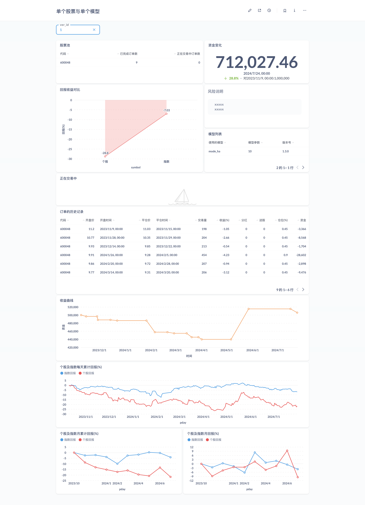

# 数据库

## 表关系图


---

## PG view 和 funcion

## view 部分说明

---

###  资金变化

* **e2q_cash**

> **说明:**
    初始化资金与当前资金的情况.


> 示例:
```
E2Q=> select * from e2q_cash;
 stock  | verid | init_cash | now_cash  | diff_cash  |  diff_per   |          day           |        end_day
--------+-------+-----------+-----------+------------+-------------+------------------------+------------------------
 600048 |     1 |   1000000 | 675172.39 | -324827.61 | -0.32482761 | 2023-11-14 00:00:00+08 | 2024-07-29 00:00:00+08
(1 row)

```

---

###  资金变化

* **e2q_cash_se**

> **说明:**
    初始化资金与当前资金的情况.


> 示例:
```
E2Q=> select * from e2q_cash_se;
 symbol | stock  | tid |  credit   | verid |          day
--------+--------+-----+-----------+-------+------------------------
      1 | 600048 |   1 |   1000000 |     1 | 2023-11-14 00:00:00+08
      1 | 600048 |  20 | 675172.39 |     1 | 2024-07-29 00:00:00+08
(2 rows)

```

---

###  订单历史记录

* **e2q_history**

> **说明:**
    回测过程中的所有订单历史记录.


> 示例:
```
E2Q=> select * from e2q_history limit 2;
 sid | verid | symobl | stock  | buy_price |        buy_time        | stop_price |       stop_time        | sell_adjpx | buy_adjpx | profit |  closetck  |   LossOrProfit   | cash | share |  quantid   |  bticket   |  sticket   | position | amount | qty
-----+-------+--------+--------+-----------+------------------------+------------+------------------------+------------+-----------+--------+------------+------------------+------+-------+------------+------------+------------+----------+--------+-----
   2 |     1 | 179591 | 600048 |     11.11 | 2023-11-14 00:00:00+08 |      10.94 | 2023-11-16 00:00:00+08 |    252.048 |   254.737 | -1.056 | 1030228911 | StrategicClosing |    0 |     0 | 1030228909 | 1030228911 | 1030228913 |      0.2 |  -1513 |  89
   6 |     1 | 179591 | 600048 |      9.91 | 2024-01-26 00:00:00+08 |       9.23 | 2024-03-04 00:00:00+08 |    224.999 |   235.755 | -4.562 | 1030228915 | StrategicClosing |    0 |     0 | 1030228909 | 1030228915 | 1030228919 |     0.45 | -15232 | 224
(2 rows)

```

---

###  订单的仓位情况

* **e2q_postion**

> **说明:**
    回测过程中的关于订单占当前仓位的情况.


> 示例:
```
E2Q=> select * from e2q_postion ;
 verid |  quantid   | values | type |          date          |       rule
-------+------------+--------+------+------------------------+-------------------
     1 | 1030228909 |   0.45 |    2 | 2024-07-29 00:00:00+08 | mode_m_5/15/30/60
     1 | 1030228909 |    0.2 |    2 | 2024-05-27 00:00:00+08 | mode_m_5/15/30/60
     1 | 1030228909 |   0.45 |    2 | 2024-03-22 00:00:00+08 | mode_m_5/15/30/60
     1 | 1030228909 |   0.45 |    2 | 2024-03-04 00:00:00+08 | mode_m_5/15/30/60
     1 | 1030228909 |    0.2 |    2 | 2023-11-16 00:00:00+08 | mode_m_5/15/30/60
(5 rows)

```

---

###  订单最原始的记录

* **e2q_primitive**

> **说明:**
    回测过程中的关于订单如何在数据表中记录的情况.


> 示例:
```
E2Q=> SELECT * FROM "e2q_primitive" limit 3;
 verid | id | stat | side | price |  adjpx  | stoppx | cumqty | leavesqty | openqty | qty |          date          |    argv    |  name  |   ticket   |  closetck  | amount
-------+----+------+------+-------+---------+--------+--------+-----------+---------+-----+------------------------+------------+--------+------------+------------+--------
     1 |  1 |    0 |    1 | 11.17 |       0 |      0 |      0 |         0 |       0 |  89 | 2023-11-14 00:00:00+08 | 5/15/30/60 | mode_m | 1030228911 |          0 |      0
     1 |  2 |    2 |    1 | 11.11 | 254.737 |      0 |     89 |         0 |       0 |  89 | 2023-11-14 00:00:00+08 | 5/15/30/60 | mode_m | 1030228911 |          0 |  98879
     1 |  3 |    0 |    2 |     0 |       0 |     11 |      0 |         0 |       0 |  89 | 2023-11-16 00:00:00+08 | 5/15/30/60 | mode_m | 1030228913 | 1030228911 |      0
(3 rows)

```

---

###  参数的收益值

* **e2q_profit**

> **说明:**
    回测过程中的各个策略的参数收益情况.


> 示例:
```
E2Q=> SELECT * FROM "e2q_profit";
    argv    | profits | verid
------------+---------+-------
 5/15/30/60 |  500000 |     1
 5/20/30/60 |  477628 |     1


```

---

###  股票池

* **e2q_symbol_pool**

> **说明:**
    股票池列表.


> 示例:
```
E2Q=> select * from e2q_symbol_pool;
 verid | stock  | trader_number | trading_number
-------+--------+---------------+----------------
     1 | 600048 |             5 |              0
(1 row)

```

---

###  正在交易中

* **e2q_trading**

> **说明:**
    正在交易进行中的订单.


> 示例:
```
E2Q=> select * from e2q_trading;
 id | verid | symbol | stock | open_price | open_qty | open_time | ticket | amount | quantid | name | argv
----+-------+--------+-------+------------+----------+-----------+--------+--------+---------+------+------
(0 rows)


```

---

## function 部分说明

---

###  资金情况

* **quant_profit**

> **说明:**
    资金的详细变化.

    - 参数: quantid 
    - 参数: credit


> 示例:
```
E2Q=> SELECT
    pday as "时间",
    profit_sum AS "资金",
    CASE
        WHEN pside = 1 THEN '开仓'
        ELSE '平仓'
    END AS "状态"
from "quant_profit" (
        (
            SELECT "quantid"
            from "analse"
            LIMIT 1
        ), (
            SELECT "credit"
            from "trade_report"
            ORDER BY id
            LIMIT 1
        )
    );
        时间         |  资金  | 状态
---------------------+--------+------
 2023-11-14 00:00:00 | 500000 | 开仓
 2023-11-16 00:00:00 | 498487 | 平仓
 2024-01-26 00:00:00 | 498487 | 开仓
 2024-03-04 00:00:00 | 483255 | 平仓
 2024-03-14 00:00:00 | 483255 | 开仓
 2024-03-22 00:00:00 | 474375 | 平仓
 2024-04-26 00:00:00 | 474375 | 开仓
 2024-05-27 00:00:00 | 495412 | 平仓
 2024-07-17 00:00:00 | 495412 | 开仓
 2024-07-29 00:00:00 | 477628 | 平仓
(10 rows)

```

---

###  可从版本号取资金情况

* **quant_profit_one_verid**

> **说明:**
    资金的详细变化.
    
    - 参数: verid 

> 示例:
```
E2Q=> SELECT * from quant_profit_one_verid (1);
        vday         | vprofit_sum | stat | verid
---------------------+-------------+------+-------
 2023-11-14 00:00:00 |      500000 | 开仓 |     1
 2023-11-16 00:00:00 |      498487 | 平仓 |     1
 2024-01-26 00:00:00 |      498487 | 开仓 |     1
 2024-03-04 00:00:00 |      483255 | 平仓 |     1
 2024-03-14 00:00:00 |      483255 | 开仓 |     1
 2024-03-22 00:00:00 |      474375 | 平仓 |     1
 2024-04-26 00:00:00 |      474375 | 开仓 |     1
 2024-05-27 00:00:00 |      495412 | 平仓 |     1
 2024-07-17 00:00:00 |      495412 | 开仓 |     1
 2024-07-29 00:00:00 |      477628 | 平仓 |     1
(10 rows)

```

---

###  返回个股日线周期累计回报收益

* **quant_return**

> **说明:**
    返回个股日线周期累计回报收益.
    
    - 参数: cficode 

> 示例:
```
E2Q=> SELECT * from quant_return(179591) limit 5;
        pday         |  price   |     return_value
---------------------+----------+----------------------
 2023-10-10 00:00:00 | 277.8318 |                    0
 2023-10-11 00:00:00 | 276.5666 | -0.45538343702916406
 2023-10-12 00:00:00 |  275.459 |   -0.854041905930129
 2023-10-13 00:00:00 | 277.6734 | -0.05701291212883908
 2023-10-16 00:00:00 | 275.9338 |  -0.6831471415439009
(5 rows)


```

---

###  返回个股月累计回报

* **quant_return_month**

> **说明:**
    返回个股月累计回报.
    
    - 参数: cficode 

> 示例:
```
E2Q=> SELECT * from quant_return_month(179591) limit 5;
  pday   |  price   |    return_value
---------+----------+---------------------
 2023-10 | 277.8318 |                   0
 2023-11 |  253.313 |  -8.825051703944617
 2023-12 | 241.2914 | -13.151986201723481
 2024-01 | 235.5966 | -15.201715570355875
 2024-02 | 229.9022 |  -17.25130096698794
(5 rows)

```

---

###  返回个股月回报

* **quant_return_fmonth**

> **说明:**
    返回个股月回报.
    
    - 参数: cficode 

> 示例:
```
E2Q=> SELECT * from quant_return_fmonth(179591) limit 5;
  pday   |  price   |    return_value
---------+----------+---------------------
 2023-10 | 277.8318 |                   0
 2023-11 |  253.313 |  -8.825051703944617
 2023-12 | 241.2914 |  -4.745749329880415
 2024-01 | 235.5966 |  -2.360133846461173
 2024-02 | 229.9022 | -2.4170128091831558
(5 rows)


```

---

## 数据可以采用 BI 分析

### metabase 数据分析


来源: [metabase](https://github.com/metabase/metabase)

